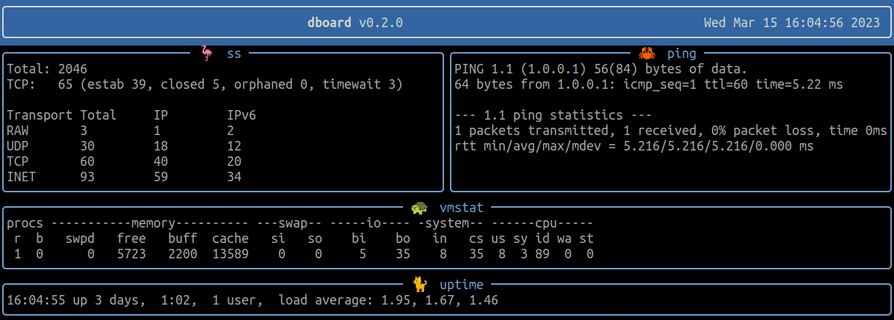

# dboard

`dboard` is a terminal dashboard, using python's [textualize/rich](https://github.com/textualize/rich) library and inspired by [wtfutil/wtf](https://github.com/wtfutil/wtf).

Allows to execute multiple commands, configured with a simple YAML file, and display the data output.
Useful a way to visualize and monitor stats, systems changes, and service status.




### Usage

```sh
# > # virtual environment
python3 -m venv .venv
source .venv/bin/activate
# or simply use uv
# uvx dboard
# > # install
pip install dboard
dboard --help
```

* Edit the config file in `~/.config/dboard/config.yml`
* You can set a custom config path with `dboard -c /path/config.yml`

### Features

* [x] execute multiple commands asynchronously
* [x] configure with a YAML file


### Development

Run locally:

* Use source: clone this repo and run `python3 -m dboard` or `make app`

```yml
# make help
Usage:
  env            :  create venv and install dependencies locally
  app            :  run app locally
  req            :  update requirements.txt
  bin            :  create binary file
  lint           :  lint code
  help           :  show help message
```

```sh
# add dependecies
uv add rich PyYAML pydantic
uv add --dev pytest coverage pytest-cov pytest-xdist ruff mypy types-PyYAML
```


##### Dashboard alternatives:

* [wtfutil/wtf](https://github.com/wtfutil/wtf)
* [sqshq/sampler](https://github.com/sqshq/sampler)
* [mum4k/termdash](https://github.com/mum4k/termdash)
* [fdehau/tui-rs](https://github.com/fdehau/tui-rs)
* [yaronn/blessed-contrib](https://github.com/yaronn/blessed-contrib)
